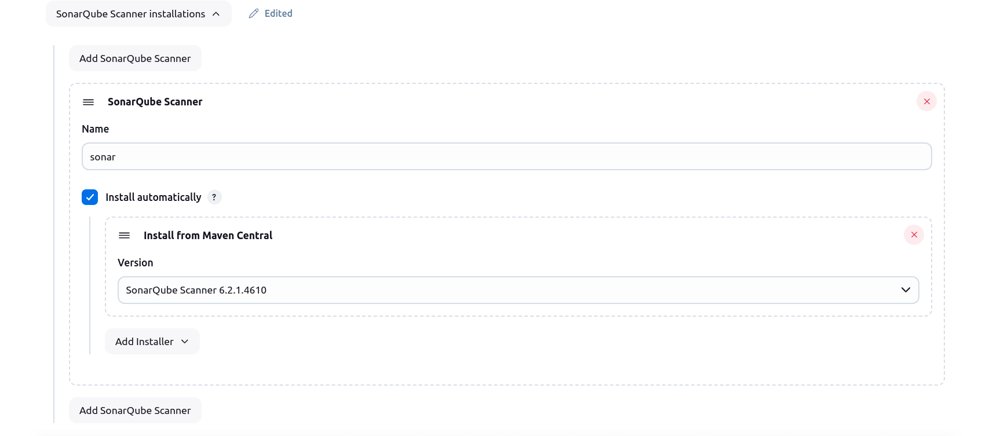
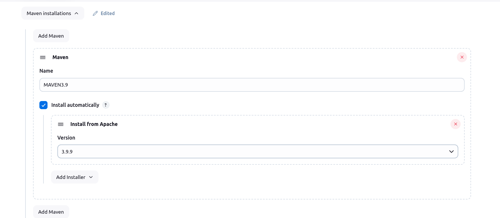
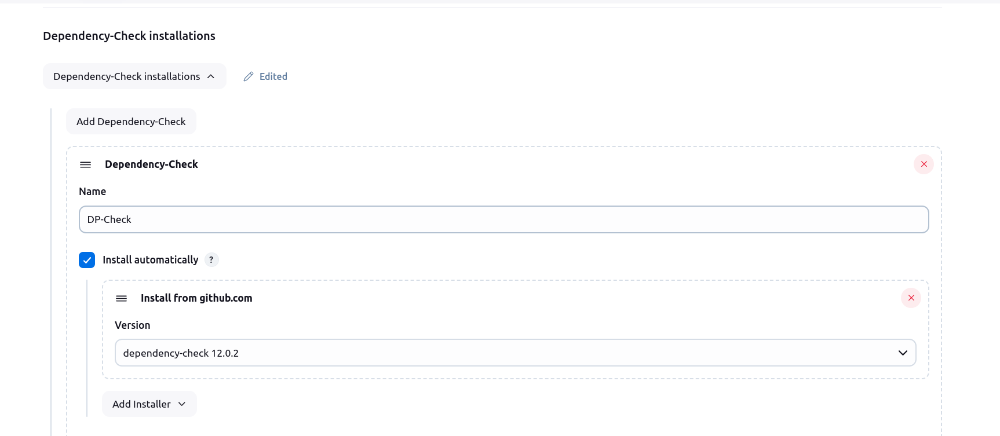
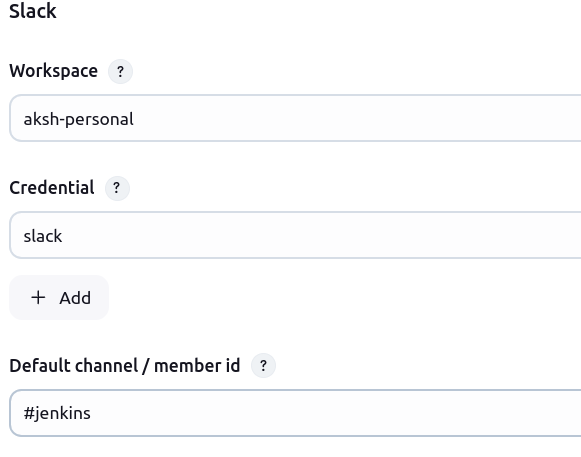
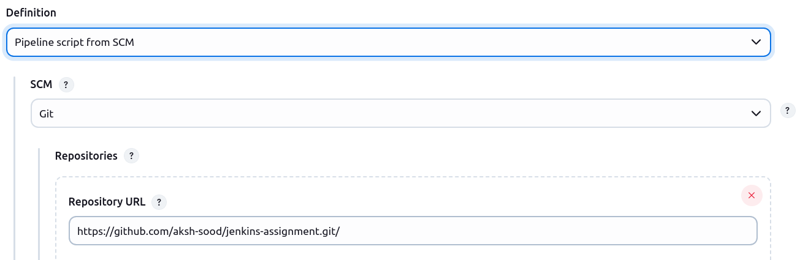
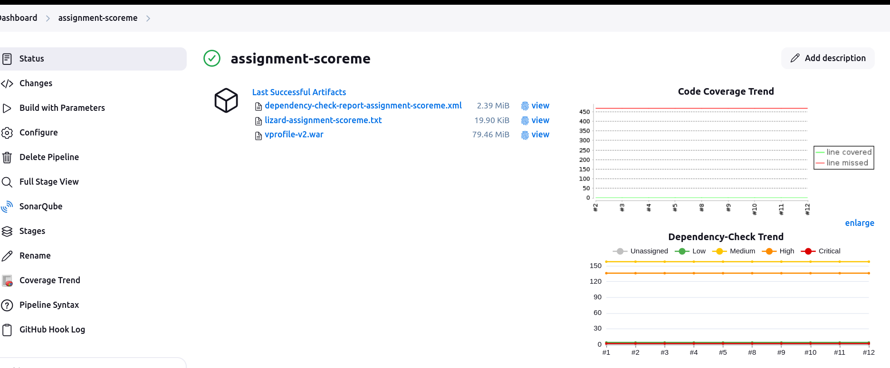
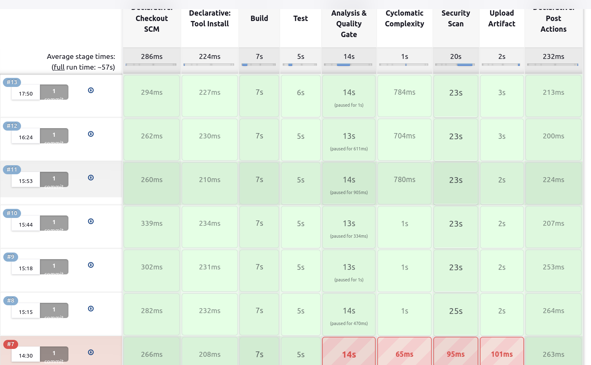
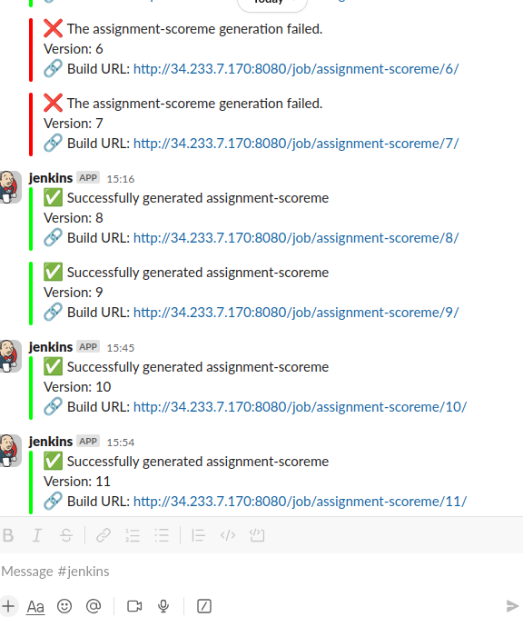

# README #

The following repository is meant to demonstrate the working of a jenkins pipeline project with a springboot application and integrating multiple tools for code quality and security checks.

# Description

 The [Jenkinsfile](./Jenkinsfile) conatins the source code for configuring the Jenkins pipline project. The pipeline integrates multiple tools and for ensuring a smooth build process for the applicaiton with code testing, coverage, cyclomatic complexity, vunerability scaning.

 Tools used:
- **SonarQube** for code quality checks
- **Jacoco** code coverage
- **Nexus** repository for storing the artifacts
- **Lizard** for  cyclomatic complexity
- **OWASP Dependency Check** for vunerability scanning

The pipeline can be triggered in two ways:
- Mannual Build triggers
- Automatic **Git Webhook triggers** on push event on the repository

# Prerequisites for setting up the pipeline

1. The following server should be setup and running
    - Jenkins
    - SonarQube
    - Nexus
2. Following plugins are required on Jenkins other than default ones:
    - Build Timestamp Plugin
    - Build Timeout
    - SonarQube Generic Coverage Plugin
    - SonarQube Scanner for Jenkins
    <!-- - Eclipse Temurin installer Plugin (check this one) -->
    - Hidden Parameter plugin
    - JaCoCo plugin
    - Nexus Artifact Uploader
    - OWASP Dependency-Check Plugin
    - Slack Notification Plugin
3. Springboot application code with Jacoco plugin installed in POM file.

4. Slack workspace for recieving notifications

5. NVD API Key for Dependency check package download. The package can be downloaded without this key as well but the time it will take will instrease darastically.

6. Lizard is installed on the jenkins system. Commands for it is `pip install lizard` if this is not working then use `pip install --break-system-packages lizard` but it can break python packages. 

# Server setup

### SonarQube

For this project we are using a ubuntu AWS EC2 machine with public access. Below are the steps:
1. Launch the instance with the following [user data script](./userdata/sonar-setup.sh). Nginx proxy is already set here on port 9000.
2. Login to the server and set the new password. 
3. Setup a new code Quality Gate. Go to Quality Gates Tab and click on Create.
4. Give the name `vprofile` to the quality gate. 
5. Edit the quality gate settings to match your requirements. In this case set coverage to 80% .

### Nexus
For this project we are using a amazon linux AWS EC2 machine with public access on port 8081. Below are the steps:
1. Launch the instance with the following [user data script](./userdata/nexus-setup.sh). 
2. Login to the server and set the new password. 
3. Create a new repository, Click on Settings > Repostories > Create Respository. 
4. Select type as `maven2(hosted)` and give you repo a name `(vprofile-repo)`.

# Setting up the pipeline

The jenkins tools and system configuration needs to be setup in jenkins before running the pipeline.

### Github Webhook

Set the webhook on the github repository by going to repository settings and adding the following webhook: `http://<jenkins-address>/github-webhook/`.

### Tools

1. Set up the sonarqube scanner installation as shown in the image.

2. Set up the maven installation as shown in the image.

3. Set up Dependency check installation.

### Jenkins system configuration

1. Setup following Global environment variables
    - DP_API_KEY: For Dependency Check installation
    - NEXUS_URL: Address if Nexus server
2. Setup Crednetials for following:
    - Slack notification token
    - SonarQube token for authentication
3. Setup SonarQube Server by providing follwing:
    - SonarQube address
    - SonarQube token
4. Slack configuraiton for recieving notifications by giving workspace name, slack token, channel name

### Creating the pipeline 

1. Go to Jenkins Home and create a new pipeline project. 
2. Go to **Triggers** and check on **GitHub hook trigger for GITScm polling** for webhook triggers.
3. Scroll to the bottom of pipeline configuration and select `Pipeline Script from SCM` in Pipeline Defination.
4. Configure the  Pipeline Defination to point to this repo adn build the main branch as default and save it.

5. Click on Build and enjoy the pipeline.

The notiifcations can be seen on slack channel as below.

# Different components of pipeline

Below is a deep breakdown of the pipeline code. 

1. **Agent**: The pipeline can run on any agent. For the current project on slaves have been setup and the master node is used to run the job.
//TODO:PREREQ1
2. **Tools**: This pipeline is configuring two tools **MAVEN** version 3.9 and **JDK** version 21 ensuring to install them if not already present on the machine. 

3. **Parameters**: We are configuring multiple build parameters in the pipeline in this block. explaining the parameters below:
    - SONARQUBE_SCAN(*bool*): To run SonarQube scan or skip it.
    - RUN_LIZARD(*bool*): To run cyclomatic complexity using Lizard.
    - RUN_DP_CHECK(*bool*): To run Dependency Check or not.
    - ALLOWED_CRITICAL_VUNERABILITIES(*string*): The permisive number of critical vunerabilities in code. 
>The project has **3 CRITICAL** vunerabilites hence not failing the pipeline on finding such vunerabilites> instead feature flagging the pipeline to run with different criteria or skipping the tests.

4. **Environment** Block: Used for setting up pipeline environment variables *jobName* for getting the name of the pipline and *scannerHome* configuring the SonarQube tool. 

5. **Stages**: There are multiple stages in the pipeline from building artifacts to pushing them to repository described in below.
    - *Build*: This stage builds the war file for the application. If build is sucessful then   builds and publishes the *Jacoco* coverage report and archive the `.war` file. The *Jacoco* report is stored in the workspace of the pipline at `target/site/jacoco/index.html`. If the build step fails then exception is thrown shuting the pipeline down.
    - *Test*: Maven test command is run in this stage to test the code and if failiure occurs pipeline throws an exception.
    - *SonarQube Analysis & Quality Gate*: This is an optionally executed stage base on `SONARQUBE_SCAN` input, loads the SonarQube global environment variable `sonarserver` and runs the sonarqube analysis on the code with multiple flags for configuration. After the analysis the QualitY Gate is triggered in the post step wher if the quality gate is passed then the pipeline moves to next stage.
    - *Cyclomatic Complexity*: Lizard analyses the code in this stage and generats the report with name `lizard-<job-name>.txt`, it is also archived in the post step. Triggered only if `RUN_LIZARD` is `true`.
    - *Security Scan*: In this stage the Dependency Check is run on the code for vunerability scanning and XML report is generated under the name `dependency-check-report-<jobName>.xml`. The report is anaylized for vunerabilites and based on the passing criteria for CRITICAL vunerabilties the stage is evaluted. At the end the report is archived as a post action. Triggered only if `RUN_DP_CHECK` is selected.
    - *Upload Artifact*: The generated `war`,`lizard`,`owasp` files are uploaded to the nexus repository with configuration of the Nexus version, address of the nexus server and artifact configuration to upload.
6. *Notification (POST)*: Once the job is a finshed a notification is sent to slack channel depending on the stabiltiy/failiure of the build.

 

